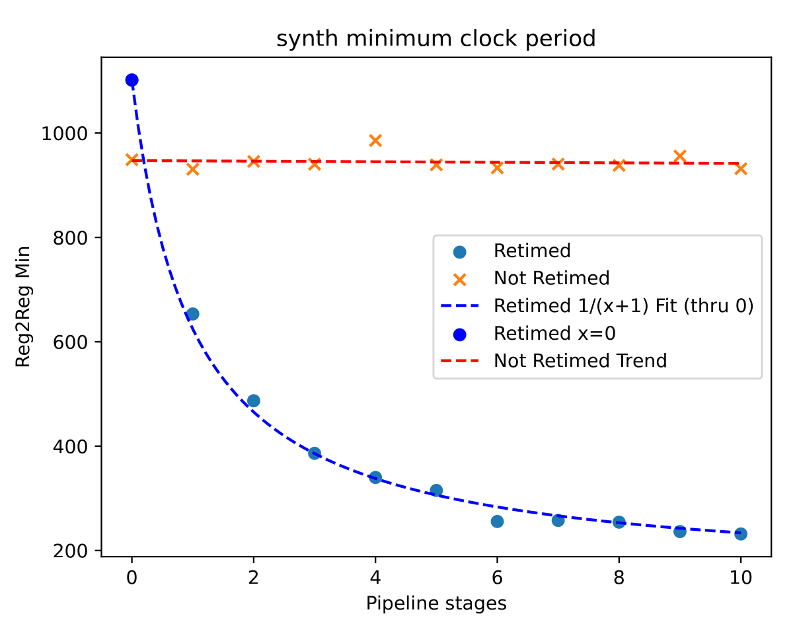
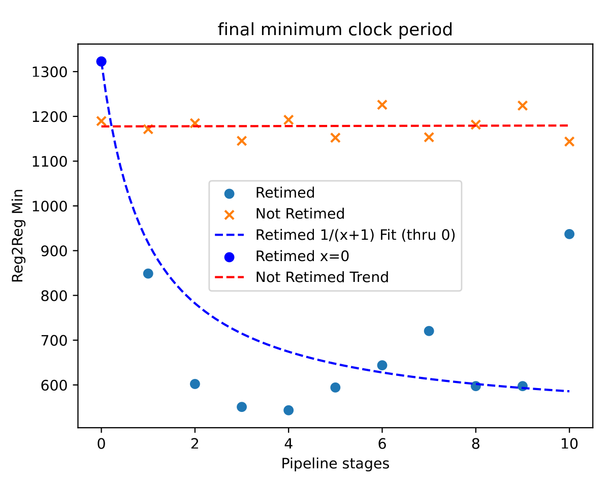

# Retiming experiment

Two simple to express problems that are neatly solved with retiming:

- a combinational wide multiplier, needs pipeline stages
- synchronous reset with a large fan-out, needs several pipeline stages to fan out the synchronous reset

Chisel code illustrating retiming challenge:

```scala
    withReset(ShiftRegister(reset.asBool, config.latency)) {
      io.out := ShiftRegister(
        io.in.reduce(_ * _),
        config.latency,
        0.U,
        true.B
      )
    }
```

This translates into Verilog for 3 pipeline stages as:

```verilog
module Multiplier_3_core(
  input         clock,
  input         reset,
  input  [63:0] io_in_0,
  input  [63:0] io_in_1,
  output [63:0] io_out
);

  // Pipeline registers for synchronous reset
  reg         reset_stage_0;
  reg         reset_stage_1;
  reg         reset_stage_2;

  // Pipeline registers for multiplier output
  reg [127:0] mult_out_stage_0;
  reg [127:0] mult_out_stage_1;
  reg [127:0] mult_out_stage_2;

  always @(posedge clock) begin
    // Shift the reset signal through pipeline stages
    reset_stage_0 <= reset;
    reset_stage_1 <= reset_stage_0;
    reset_stage_2 <= reset_stage_1;

    if (reset_stage_2) begin
      // Clear pipeline registers on reset
      mult_out_stage_0 <= 128'h0;
      mult_out_stage_1 <= 128'h0;
      mult_out_stage_2 <= 128'h0;
    end else begin
      // Pipeline the multiplier output
      mult_out_stage_0 <= {64'h0, io_in_0} * {64'h0, io_in_1};
      mult_out_stage_1 <= mult_out_stage_0;
      mult_out_stage_2 <= mult_out_stage_1;
    end
  end

  // Output the lower 64 bits of the final pipeline stage
  assign io_out = mult_out_stage_2[63:0];
endmodule
```

## Running the sweep

A 64x64 bit multiplier with synchronous reset flip-flops is instantiated with 0-15 pipeline stages and reg2reg minimum clock period is measured.

    bazelisk run //multiplier:plot
    xdg-open bazel-bin/multiplier/plot.pdf




